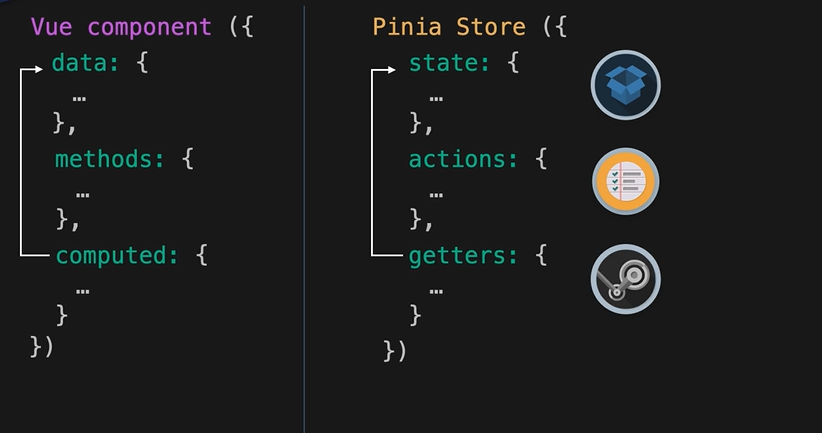
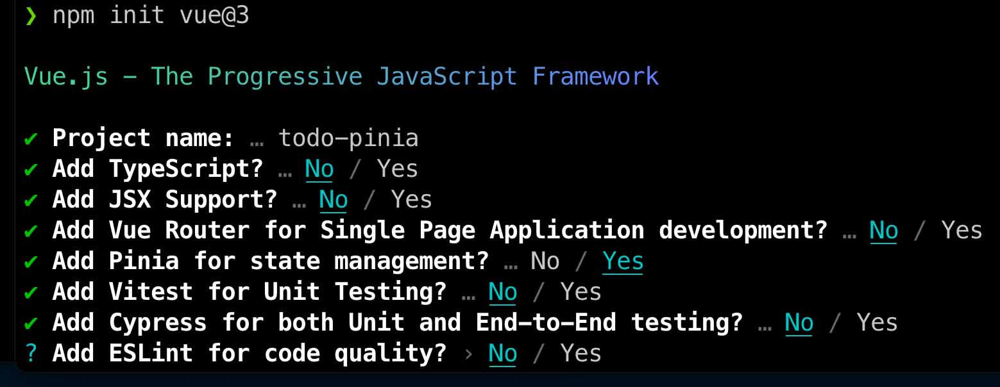

# What is Pinia ? 

- used to help manage state in an application
- with reactive states
- store: pattern for state management

- Pinia is modular by design so you can create multiple stores
- helps provide bundlers with code-splitting
- provides better typescript inference
- can be created as Options API or Composable API
- Example will be a Todo list

# Creating our first store

npm init vue@3 todo-app
- choose pinia as an option

// main.js will contain the 'createStore' command

